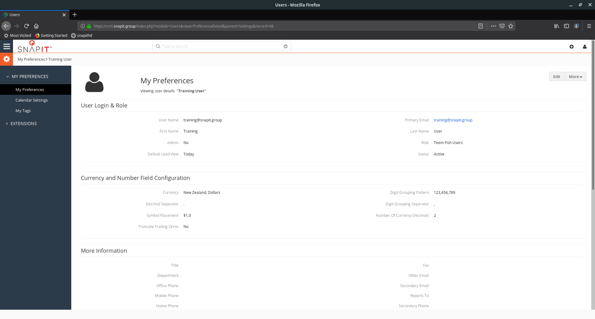

# Vtiger CRM Introduction

This document describes the instructions for your first steps in the Vtiger Customer Relationship Management application.
The following topics are covered:

- [Vtiger CRM Introduction](#vtiger-crm-introduction)
  - [How to Find Vtiger](#how-to-find-vtiger)
  - [First Sign In](#first-sign-in)
  - [Change Password](#change-password)
  - [Personal Preferences](#personal-preferences)

## How to Find Vtiger

Vtiger is accessible using the URL [https://crm.snapit.group](https://crm.snapit.group).

## First Sign In

Description | Page
-----|---------
*Step 1* - Navigate to [https://crm.snapit.group](https://crm.snapit.group). Enter your email into the username field and the password you have been provided.|
*Step 2* - If sign in is successful you will be presented with a dialog with language, timezone and date preferences. Click *Get Started*. These can be changed later through the personal preferences dialog.|
*Step 3* - After completing initial preferences, the dashboard will display. This will be empty. To navigate the CRM use the 'hamburger'  on the top left of the page next to the SnapIT logo.|

## Change Password

After the first time signed in, users should update their password from the default entered.

Description | Page
-----|---------
*Step 1* - Click on the person icon in the top right of the page. In the profile popup that displays click *My Preferences*|
*Step 2* - On the *My Preferences* page click *More* on the top right of the page, then click *Change Password*. |
*Step 4* - Enter the default password which you have been provided in the *Old Password* field. Enter your personal password in the *New Password* and *Confirm password* fields an click *Save*. Sign out and sign in again to confirm the new password is activated.|

## Personal Preferences

Vtiger provides a number of preferences that can be set to your liking.
Description | Page
-----|---------
*Step 1* - Click on the person icon in the top right of the page. In the profile popup that displays click *My Preferences* |
*Step 2* - The *My Preferences* page has a lot of personal information available that is no used at this point. The Currency and Number Field configuration is the most useful.  |
*Step 3* - The currency option allows all currency fields to be displayed in the currency you prefer. Vtiger is configured to perform conversions between currencies when they are entered.|
